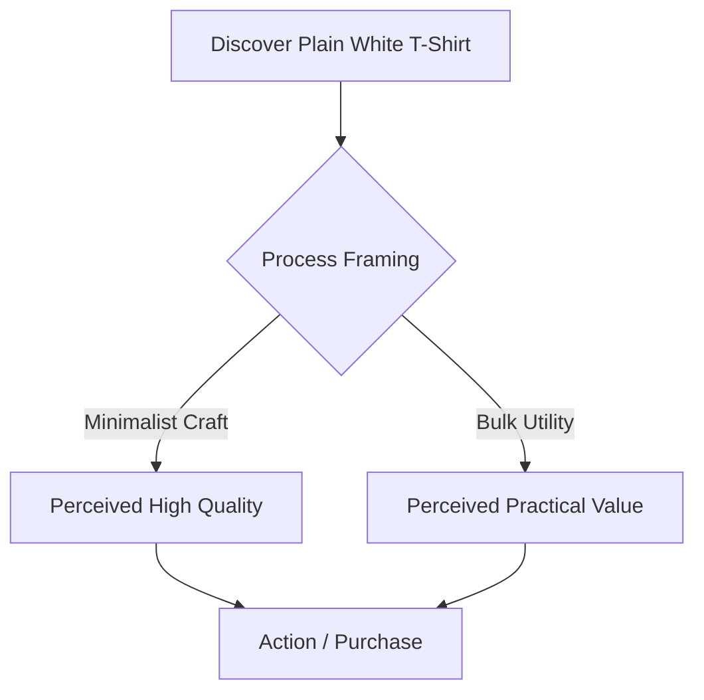

# Chapter 1: Persuasion and Human Decision-Making

Persuasion is the practice of guiding attention, shaping interpretation, and encouraging action without stripping someone of their agency. It invites an audience to align with an idea by appealing to reason, emotion, and shared values.

## Persuasion vs. Coercion and Manipulation

Understanding the moral boundaries of communication is essential:
* **Persuasion:** Transparent and respectful of personal agency. It presents genuine information and allows the audience to choose freely.
* **Manipulation:** Deceptive or covert. It conceals true intent and exploits cognitive weaknesses against the user's best interest.
* **Coercion:** Employs explicit pressure, penalties, or force, eliminating realistic alternative choices.

---

## Robert Cialdini's Six Principles of Influence

1. **Reciprocity:** People feel an innate need to return favors or concessions.
2. **Commitment and Consistency:** Individuals strive to match current actions with prior statements or choices.
3. **Social Proof:** When uncertain, people look to collective peer actions for guidance.
4. **Authority:** Credible expertise lowers decision fatigue and validates choices.
5. **Liking:** People are more receptive to communicators they find relatable or pleasant.
6. **Scarcity:** Items or access perceive higher value when availability is constrained.

---

## Additional Behavioral Concepts

* **Choice Architecture (Nudge):** Formulated by Thaler and Sunstein, this concept demonstrates that how options are presented directly impacts outcomes without restricting freedom.
* **Framing Effect:** Identical information evokes distinct responses depending on whether the highlight is on potential gains or losses.

---

## Influence Breakdown

| Principle | Mechanism | Ethical Use | Misuse Risk |
| :--- | :--- | :--- | :--- |
| **Social Proof** | Alleviates uncertainty via peers | Showing verified customer feedback | Generating synthetic review volume |
| **Scarcity** | Triggers urgency through loss aversion | Displaying verified inventory levels | Fabricating artificial countdown timers |
| **Reciprocity** | Generates mutual obligation | Supplying helpful open resources | Deploying coercive free gifts to guilt users |
| **Authority** | Leverages established credibility | Demonstrating validated technical certifications | Using paid deceptive endorsements |

---

## The Decision Journey

---

## The White T-Shirt Example

Consider an everyday white crewneck cotton shirt:
* **The Craft Angle:** Framed as *"Single-origin combed organic cotton, woven in small batches."* The shirt communicates personal discernment, durability, and mindful consumption.
* **The Utility Angle:** Packaged in a multi-pack labeled *"Heavyweight preshrunk daily essentials."* The shirt communicates convenience, baseline utility, and value.

The physical shirt never changed; only the narrative architecture did.

---

## Questions to Ask Before Trying to Persuade

* Does this design clarify choices or obscure essential trade-offs?
* Would I stand behind this persuasive mechanism if it were fully visible to the user?
* Does this message support the audience's goals or only my short-term metrics?
* Is this communication built on verified truth or synthetic urgency?

---

## Explore Further

* *Search:* Robert Cialdini influence principles in digital design
* *Search:* Thaler and Sunstein choice architecture and nudging
* *Search:* Behavioral economics framing effects examples

---

## What You Should Remember

Persuasion is a tool to direct attention and clarify value. Applied ethically, it simplifies complex decisions and builds lasting trust. Exploited carelessly, it degrades into manipulation and breaks user confidence.

Resolves #1