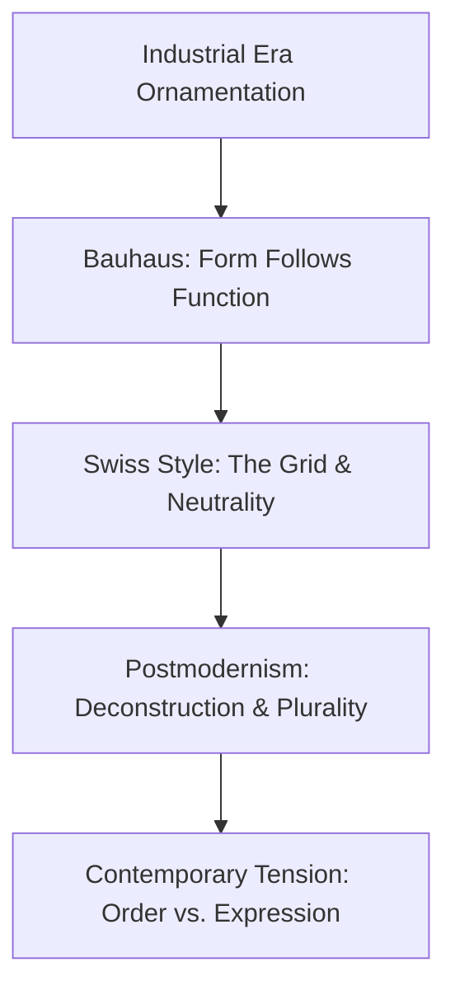

# Chapter 3: Modernism, Postmodernism, and Visual Language

Visual design is never neutral. Every layout, typeface, and color palette carries historical assumptions about order, authority, clarity, and emotion. By understanding modernism and postmodernism, designers learn to speak visual languages deliberately rather than accidentally.

---

## The Path to Modernism: Bauhaus and Swiss Style

In the early 20th century, rapid industrialization demanded visual systems suited for mass communication. 

* **The Bauhaus (1919–1933):** Founded by Walter Gropius in Germany, the Bauhaus rejected decorative ornamentation in favor of functional craft. Form follows function; art and industrial production merge.
* **Swiss Style / International Typographic Style (1950s):** Designers like Josef Müller-Brockmann and Armin Hofmann codified the mathematical grid, asymmetric layouts, flush-left rag-right typography, and objective photography. The goal was universal, rational clarity stripped of national bias.

### Core Modernist Principles
* **The Grid:** Mathematical framework establishing predictable spatial harmony.
* **Typographic Hierarchy:** Visual weights and scale directing scanning order intuitively.
* **Reduction:** Eliminating decorative noise so utility remains unambiguous.
* **Universality:** Searching for neutral forms accessible to everyone.

---

## The Postmodern Reaction: Irony and Expression

By the late 1960s through the 1990s, critics questioned modernist claims of "neutrality." Designers like Wolfgang Weingart, April Greiman, and David Carson rejected rigid grids in favor of plurality, emotional texture, layered chaos, and vernacular culture.

### Postmodern Characteristics
* **Disruption and Deconstruction:** Collapsing standard grid alignments deliberately.
* **Quotation and Pastiche:** Borrowing from street culture, historic eras, and pop media.
* **Expressive Typography:** Treating letters as expressive images rather than passive carriers of text.
* **Irony:** Questioning commercial authority while participating in it.

---

## Modernism vs. Postmodernism in Contemporary Design

| Dimension | Modernist Paradigm | Postmodern Paradigm | Contemporary Web Example |
| :--- | :--- | :--- | :--- |
| **Structure** | Strict grid, modular rhythm | Broken grids, overlapping planes | Design system dashboards vs. festival editorial sites |
| **Typography** | Objective, clean sans-serif (e.g., Helvetica) | Custom, experimental, distorted letterforms | SaaS landing pages vs. streetwear lookbooks |
| **Voice** | Authoritative, transparent, functional | Ironic, subversive, personal | Apple checkout flow vs. MSCHF interactive drops |
| **Aesthetic** | Restraint, white space, clarity | Abundance, kinetic density, raw vernacular | Linear/Stripe software vs. Gen-Z zine-style portfolios |

---

## Historical Movement Timeline

---

## The Plain White T-Shirt: Two Aesthetic Presentations

* **Modernist Presentation:** Displayed against a calibrated neutral gray background in an unbroken 12-column grid. Set in a clinical grotesque sans-serif: *"Crewneck 01. 100% Cotton. Unadorned utility."* The object communicates absolute rational purity and utilitarian honesty.
* **Postmodern Presentation:** Rendered as an overexposed photo overlaid with distressed halftone patterns, mismatched neon typography, handwritten margin notes, and an ironic barcode label: *"This is just a white shirt."* The object communicates countercultural rebellion and self-aware subversion.

---

## How to Read a Design

When evaluating any visual composition, ask:
* Does this layout prioritize immediate scanning speed or emotional confrontation?
* Is the grid acting as an invisible anchor or an element to challenge?
* Does the typography treat words as neutral data or visual texture?
* Whose voice and cultural values does this aesthetic normalize?

---

## Museum Research

To see primary artifacts from both traditions, explore institutional digital collections using targeted queries:

* **Museum of Modern Art (MoMA) Collection:** Search `Josef Müller-Brockmann posters`, `Herbert Bayer typography`, or `April Greiman digital design`.
* **Cooper Hewitt, Smithsonian Design Museum:** Search `Bauhaus textiles`, `Swiss International Typographic Style`, or `1980s new wave graphics`.
* **Victoria and Albert Museum (V&A):** Search `postmodern graphic design`, `punk typography zines`, or `Bauhaus exhibition catalogs`.

---

## What You Should Remember

Modernism taught designers how to establish functional clarity through systematic restraint. Postmodernism proved that human expression often lives in friction, irregularity, and cultural quotation. Effective digital design balances both: using modernist structure to guarantee usability while deploying postmodern energy to create distinctive character.

Resolves #3