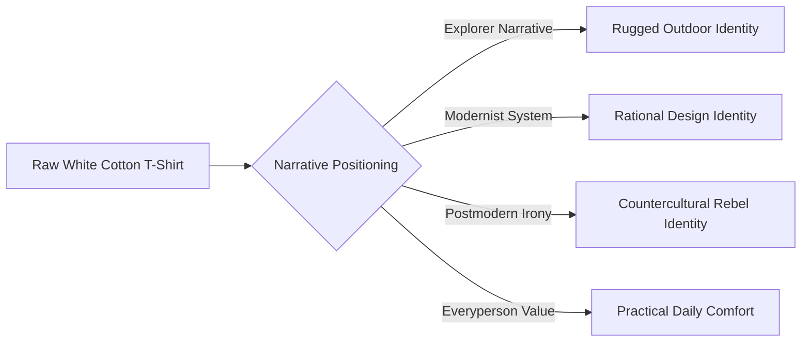

# Chapter 4: The Plain White T-Shirt Case Study

A plain white T-shirt is physically simple: spun cotton yarn, knitted fabric, rib collar, flatlock stitching. Yet the exact same shirt can retail for $12 at a discount supplier, $45 at a direct-to-consumer baseline shop, $95 at an outdoor gear brand, or $220 on a luxury runway. 

The physical textile barely changes. What transforms completely is the cultural architecture: the brand archetype, persuasive psychology, and visual design language wrapping the fabric.

---

## Concept 1: The Trailhead Heavyweight (Explorer Archetype)

* **Target Audience:** Weekend trail runners, thru-hikers, and outdoor enthusiasts who prioritize durability and functional escape.
* **Brand Archetype:** **The Explorer**
* **Persuasion Principles:** Scarcity (seasonal drop batches) and Authority (field-tested fiber ratings).
* **Visual Language:** Earthy tactile minimalism; topographic line accents, warm stone neutrals, weathered typography, loose asymmetrical grids.
* **Headline:** *"Engineered for 500 Miles on the Pacific Crest."*
* **Product Story:** Spun from high-altitude organic cotton designed to breathe under an external pack frame. Built without itchy tags or unnecessary seams, ready for the dirt road.
* **Imagery Direction:** Medium-format film photograph of a backpacker sitting on granite scree at golden hour, shirt creased with dust.
* **The Invited Meaning:** Self-reliance, rugged freedom, and detachment from urban noise.
* **Ethical Risk / Limitation:** "Greenwashing" or overstating outdoor durability for a shirt primarily worn to neighborhood coffee shops.

---

## Concept 2: Standard 01 (Restrained Modernist / Swiss Style)

* **Target Audience:** Architects, product designers, and software engineers who value objective reduction and functional honesty.
* **Brand Archetype:** **The Sage / Creator**
* **Persuasion Principles:** Commitment & Consistency (streamlining your personal wardrobe default) and Framing (framing simplicity as elevated discernment).
* **Visual Language:** **Restrained Swiss / Modernist**; strict 12-column mathematical grid, neutral off-white background, unyielding Helvetica Neue typography, stark functional whitespace.
* **Headline:** *"System Form: 220 GSM Cotton."*
* **Product Story:** Developed through rational elimination. No visible logos, no trend-driven cuts. Calibrated neckband tension engineered to retain geometric flatness across 200 industrial washes.
* **Imagery Direction:** Flat-lay technical photography under calibrated diffuse studio light; isolated against high-contrast light grey without human models.
* **The Invited Meaning:** Intellectual discipline, quiet confidence, and immunity to trend consumerism.
* **Ethical Risk / Limitation:** Pretentious elitism; using clinical aesthetics to charge triple the price for baseline commodity construction.

---

## Concept 3: NO_SIGNAL_TEE (Disruptive Postmodernism)

* **Target Audience:** Underground clubgoers, skateboarders, digital artists, and subculture youth disillusioned with clean corporate branding.
* **Brand Archetype:** **The Rebel / Outlaw**
* **Persuasion Principles:** Social Proof (insider subcultural clout) and Reciprocity (access to exclusive digital audio zines).
* **Visual Language:** **Disruptive Postmodern**; anti-grid layout, neon bleed highlights, xerox halftone distortions, inverted text layers, kinetic raw typography.
* **Headline:** *"CONSUME NOTHING / WEAR EVERYTHING"*
* **Product Story:** Printed with heat-sensitive ink along the internal hem that changes color with bodily perspiration. Cut wide, heavy, and raw.
* **Imagery Direction:** Flash-lit snapshot in an abandoned industrial stairwell; motion blur, grainy high ISO, candid and confrontational.
* **The Invited Meaning:** Subversion, belonging to an unmonetized subculture, and ironic rebellion against fashion capitalism.
* **Ethical Risk / Limitation:** Exploiting genuine anti-capitalist counterculture aesthetics purely to drive commercial retail sales.

---

## Concept 4: The Honest Staple (Everyperson Archetype)

* **Target Audience:** Working families, college students, and practical daily commuters focused on affordability and reliability.
* **Brand Archetype:** **The Everyperson**
* **Persuasion Principles:** Reciprocity (bundled discounts) and Liking (unpretentious, relatable transparency).
* **Visual Language:** Warm approachable commercial vernacular; soft rounded sans-serif fonts, natural sunny lighting, friendly card layouts, cheerful lifestyle copy.
* **Headline:** *"Your Daily Best Friend."*
* **Product Story:** Sold in bundles of three. Soft from day one, machine-washable without special instructions, and designed to fit comfortably without fuss.
* **Imagery Direction:** Bright candid photo of friends laughing around an outdoor food truck in summer daylight.
* **The Invited Meaning:** Normalcy, dependable comfort, and honest unpretentious value.
* **Ethical Risk / Limitation:** Masking questionable offshore labor standards behind warm, down-to-earth neighborly branding.

---

## Four-Way Synthesis Matrix

| Dimension | Concept 1: The Trailhead | Concept 2: Standard 01 | Concept 3: NO_SIGNAL_TEE | Concept 4: Honest Staple |
| :--- | :--- | :--- | :--- | :--- |
| **Archetype** | Explorer | Sage / Creator | Rebel | Everyperson |
| **Visual School** | Rugged Minimal | Swiss / Modernist | Postmodern Anti-Grid | Friendly Commercial |
| **Key Persuasion** | Scarcity & Authority | Framing & Consistency | In-Group Social Proof | Liking & Reciprocity |
| **Audience Need** | Escape & Autonomy | Intellectual Restraint | Rebellion & Subculture | Comfort & Practicality |
| **Price Point** | $85 | $110 | $130 (Drop) | $28 (3-Pack) |

---

## Market Synthesis Architecture

---

## What You Should Remember

Products are physical artifacts, but brands are narrative ecosystems. By manipulating visual hierarchy, archetypal framing, and psychological triggers, designers alter how value is perceived without ever touching the manufacturing line. Responsible designers recognize this leverage and deploy it with transparency rather than deception.

Resolves #4